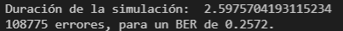
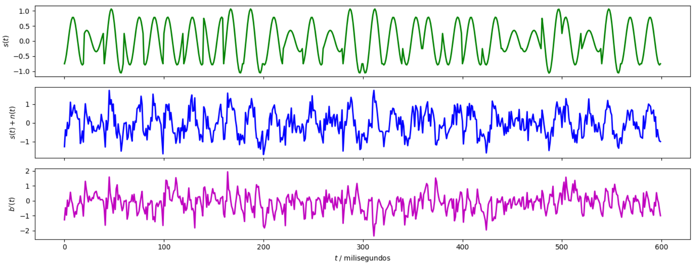
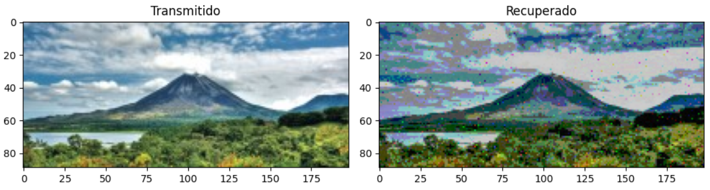
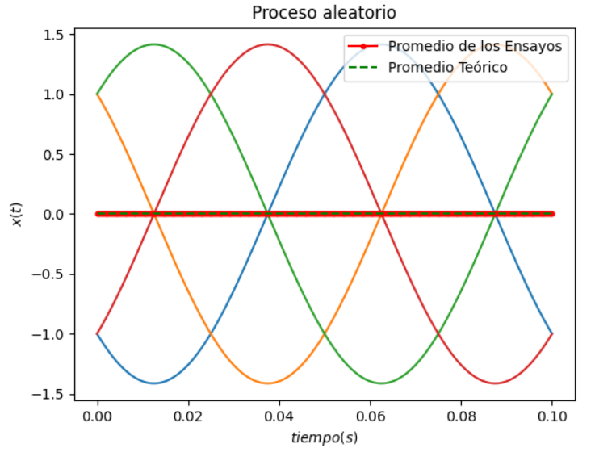
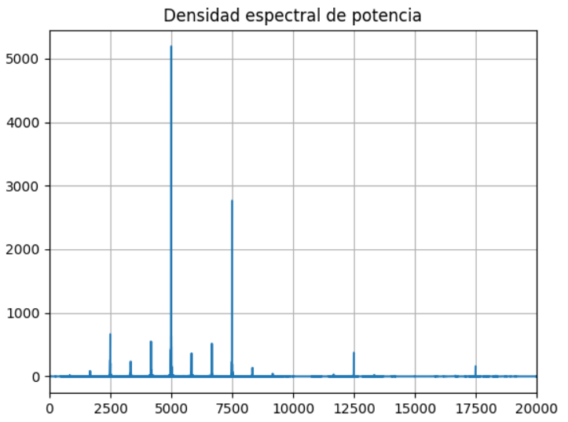

## Universidad de Costa Rica
### Escuela de Ingeniería Eléctrica
#### IE0405 - Modelos Probabilísticos de Señales y Sistemas

---

# Proyecto4

* Estudiante: **Alfonso Castillo Orozco**
* Carné: **B41546**
* Grupo: **2**

---
## 1. - Modulación 16-QAM

* (50%) Realice una simulación del sistema de comunicaciones como en la sección 3.2., pero utilizando una modulación **16-QAM** en lugar de una modulación BPSK. Deben mostrarse las imágenes enviadas y recuperadas y las formas de onda.

Solución implementada en el archivo P4.py.

A continuación se muestran los datos obtenidos en consola de la simulación.

La siguiente imagen muestra las señales de interés, en donde se omitió la de modulación b(t), ya que como se menciona en el video como parte de la explicación del proyecto, esta señal era opcional. Aunque al ejecutar el código esta se genera, los datos no son correctos por lo antes dicho (gráfica de color rojo, ignorar en ejecución).

Se presenta la imagen transmitida vs recuperada, se ve que se perdió mucha información, pero aún así es distinguible la imagen del Arenal.

## 2. - Estacionaridad y ergodicidad

* (30%) Realice pruebas de estacionaridad y ergodicidad a la señal modulada `senal_Tx` y obtenga conclusiones sobre estas.

Solución implementada en el archivo P4.py.

Se presenta 4 ensayos con sus promedios para realizar el análisis.

Se obtiene que tanto el promedio de los ensayos como el teórico coinciden, ambos en cero, esto quiere decir que es un proceso ergódico.
Como el promedio de las señales de prueba son constantes, se dice que este es un proceso estacionario.

## 3. - Densidad espectral de potencia

* (20%) Determine y grafique la densidad espectral de potencia para la señal modulada `senal_Tx`.

Solución implementada en el archivo P4.py.

Se presenta la gráfica de densidad espectral de potencia.

